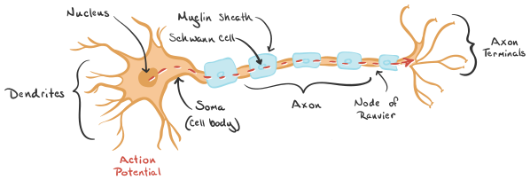

## Simple Linear Regression

Simple linear regression is a statistical technique for finding the existence of an association relationship between a dependent variable and an independent variable.
Simple linear regression implies that there is only one independent variable in the model. Regression is one of the most important techniques in predictive analytics since many prediction problems are modeled using regression.

### Action Potentials in Dragons

Brain cells, called neurons (diagram shown below), send information throughout the brain and body. The information is sent via electro-chemical signals known as action potentials that travel down the length of the neuron. These neurons are then triggered to release chemical messengers at synapses, called neurotransmitters, which help trigger action potentials in nearby cells, and so help spread the signal all over. An action potential travels down a neuron's axon in an ion cascade. (Source: [Khan Academy](https://www.khanacademy.org/test-prep/mcat/organ-systems/neuron-membrane-potentials/a/action-potential-velocity)).



In the imaginary land of Westeros, the once extinct dragons were spotted again. The maesters of the capital, King's Landing, were summoned to study the nervous systems of these dragons. They were curious about how such large beings were able to move around so quickly. They studied 67 nerve bundles of two dragons and measured the **maximal conduction velocity** across fibers and the **axon diameter** of the largest fiber (Similar to the study conducted by Hursh in 1939). What they observed is stored on the [GitHub repository](https://github.com/Data-Analytics-UE20CS312/Unit-2-Worksheets/blob/main/2a%20-%20Simple%20Linear%20Regression/dragon_neurons.csv).


**Data Dictionary**

    axon_diameter: diameter of the axon in micrometers
    conduction_velocity: conduction velocity of action potentials in meters per second

### Points
The problems in this worksheet are for a total of 10 points with each problem having a different weightage.

- *Problem 1*: 1 point
- *Problem 2*: 3 points
- *Problem 3*: 3 points
- *Problem 4*: 1 point
- *Problem 5*: 2 points

### Data reading

```{r}
library(ggplot2)
dragon_neurons <- read.csv('dragon_neurons.csv')
head(dragon_neurons)
```


### Problem 1 (1 point)

Find if a linear model is appropriate for representing the relationship between the conduction velocity (response variable) and axon diameter (explanatory variable) by finding the OLS solution. Print out the slope and the coefficient. Plot the OLS best-fit line of the model (Hint: use the `ggplot` library).
```{r}
slope<-cor(dragon_neurons$axon_diameter, dragon_neurons$conduction_velocity)*(sd(dragon_neurons$conduction_velocity/dragon_neurons$axon_diameter))
print(slope)
```
```{r}
intercept<-mean(dragon_neurons$conduction_velocity) - (slope*mean(dragon_neurons$axon_diameter))
print(intercept)
```
```{r}
cor(dragon_neurons$axon_diameter, dragon_neurons$conduction_velocity)
```
```{r}
ggplot(dragon_neurons,aes(x = dragon_neurons$axon_diameter, 
                          y = log(dragon_neurons$conduction_velocity))) + geom_point(colour = "blue") +
  geom_smooth(method = "lm", fill=NA, colour = "black")
```

The slope and intercept are 0.07 and 0.42 respectively.
The correlation coefficient is 0.87


### Problem 2 (3 points)

Plot the residuals of the model. Do the residuals look like white noise? If they do not, try to find a suitable functional form (hint: try transforming either x or y using natural-log or squares).
```{r}
lmodel<-lm(log(dragon_neurons$conduction_velocity)~(dragon_neurons$axon_diameter), data = dragon_neurons)
lmodel$coefficients
```
```{r}
plot(x = lmodel$residuals)
```

```{r}
qqnorm(lmodel$residuals)
qqline(lmodel$residuals)
```


### Problem 3 (3 points)

Using Mahalanobis distance as a metric, are there any potential outliers you notice? What are their Mahalanobis distances? Use the model that you decided on in the previous problem (Problem 2) as your regression model. Ensure that you plot the ellipse with a radius equal to the square root of the Chi-square value with 2 degrees of freedom and 0.95 probability.
```{r}
conduction_velocity<-log(dragon_neurons$conduction_velocity)
dg = data.frame(conduction_velocity, dragon_neurons$axon_diameter)
```

```{r}
library(car)
model = dragon_neurons[c("conduction_velocity","axon_diameter")]
# Ellipse radius from Chi-Sqaure distrubiton
rad  = qchisq(p = 0.95 , df = ncol(model))
# Square root of Chi-Square value
rad  = sqrt(rad)
ellipse <- car::ellipse(center = colMeans(model) , shape = cov(model) , radius = rad ,
                        segments = 150 , draw = FALSE)

ellipse <- as.data.frame(ellipse)
colnames(ellipse) <- colnames(model)

# Create scatter Plot
figure <- ggplot(model , aes(x = axon_diameter , y = conduction_velocity)) +
       geom_point(size = 2) +
       geom_polygon(data = ellipse , fill = "orange" , color = "orange" , alpha = 0.5)
       
# Run and display plot
figure
```

```{r}
d<-mahalanobis(x = model , center = colMeans(model) , cov = cov(model))
cutoff<- qchisq(p = 0.95 , df = 2)
model[d > cutoff, ]
```
```{r}
d[5]
```

There is one potential outlier with Mahalanobis distance of 8.597.


### Problem 4 (1 point)

What are the R-squared values of the initial linear model and the functional form chosen in Problem 2? What do you infer from this? (hint: use the `summary` function on the created linear models)
```{r}
summary(lmodel)
```
```{r}
summary(lm((dragon_neurons$conduction_velocity)~(dragon_neurons$axon_diameter), data = dragon_neurons))
```
The r squared values of the initial model and the chosen functional form is 0.76 and 0.75 respectively.
The multiple R-squared value indicates that the axon diameter explains the 76% and 75% of the variation in conduction velocity.


### Problem 5 (2 points)

Using the same `summary` function as Problem 4, determine if there is a statistically significant linear relationship at a significance value of 0.05 of the **overall model** chosen in Problem 2. What do you understand about the relationship between dragons' axon diameters and conduction velocity? (Hint: understand the values displayed in `summary` and search for the right data).

The null hypothesis is that there is no relation between the two variables. The alternate hypothesis hence states that there is a relation between conduction velocity and axon diameter. The p-value shown in the above model is very small(p-value: < 2.2e-16). Since, p-value is less than 0.05 we say that there is a significant relationship and null hypothesis is rejected. Hence, we can say that there is a significant linear relationship between axon diameter and conduction velocity.

The multiple R-squared value (0.75 or 75.78%) indicates that the axon diameter explains the 75% of the variation in conduction velocity.
The relationship can approximately be written as -
log(conduction_velocity) = 0.006*(axon_diameter) + 1.11

